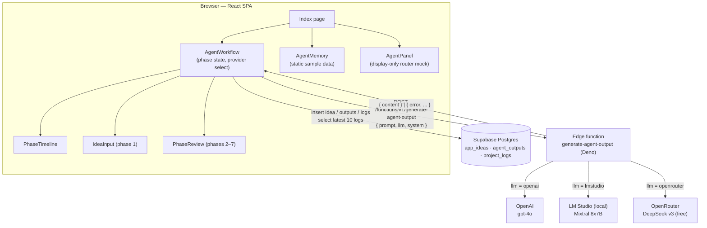

# Architecture — ThinkTank AI

A component-level map of the React application and how data flows to Supabase (Postgres) and the `generate-agent-output` edge function. Companion documents: [PROJECT_README.md](PROJECT_README.md) (overview and setup), [API.md](API.md) (edge function contract), [DATA_MODEL.md](DATA_MODEL.md) (schema).

---

## Application shell

Boot chain: `index.html` → `src/main.tsx` (`createRoot`) → `src/App.tsx`.

`App.tsx` mounts, outermost first:

1. `QueryClientProvider` — TanStack React Query client (configured, but no component currently uses `useQuery`/`useMutation`; all data access is direct `supabase-js` calls)
2. `TooltipProvider` (Radix/shadcn)
3. Two toast outlets: shadcn `Toaster` and `Sonner` (available app-wide; the current components don't yet fire toasts)
4. `BrowserRouter` with two routes:

| Route | Page | File |
|---|---|---|
| `/` | `Index` — the entire application | `src/pages/Index.tsx` |
| `*` | `NotFound` — 404 with console.error logging of the missed path | `src/pages/NotFound.tsx` |

## Component map

`Index.tsx` renders a header ("ThinkTank AI — A fully local, self-hosted AI app builder", plus a "Private Mode" badge) and a three-panel layout:

```
Index (src/pages/Index.tsx)
├── <aside> left  (hidden below xl) ─ AgentMemory
├── <main>  center                  ─ AgentWorkflow
│    ├── PhaseTimeline
│    ├── IdeaInput      (phase 1 only)
│    └── PhaseReview    (phases 2–7)
└── <aside> right (hidden below lg) ─ AgentPanel
```

| Component | File | Role | State/data |
|---|---|---|---|
| `AgentWorkflow` | `src/components/AgentWorkflow.tsx` | **The working core.** Owns the 7-phase pipeline, provider selection (OpenAI / LM Studio / OpenRouter dropdown), calls the edge function, persists results, renders the live log panel. | `useState` for phase index, idea, outputs, feedback, `appIdeaId`, loading, provider, logs; `useEffect` re-fetches the 10 newest `project_logs` rows on phase change. |
| `PhaseTimeline` | `src/components/PhaseTimeline.tsx` | Presentational step indicator: numbered nodes, check marks for completed phases, agent name per phase. | Props only. |
| `IdeaInput` | `src/components/IdeaInput.tsx` | Controlled form for the initial idea; submit disabled while empty. | Props only. |
| `PhaseReview` | `src/components/PhaseReview.tsx` | Shows the current phase's generated output and a feedback textarea. Feedback lives in `AgentWorkflow` local state and is not persisted or sent to the LLM. | Props only. |
| `AgentPanel` | `src/components/AgentPanel.tsx` | Right sidebar: agent roster with descriptions, an "LLM Router" button group (five options incl. DeepSeek and Mock Mode), plugin placeholders, export buttons. **Display-only prototype UI** — its selection state drives nothing, and the export/docs buttons have no handlers. | Local `useState` (selected LLM, dismissible "Agent Ideas" list). |
| `AgentMemory` | `src/components/AgentMemory.tsx` | Left sidebar: "Agent Memory & Logs" styled with hardcoded sample entries; footer notes "Session memory — stored locally for privacy. v0.1". Not connected to the database. | Static data. |
| `components/ui/*` | 40+ files | Full shadcn/ui library scaffolded by Lovable. The running app mounts `toaster`, `sonner`, and `tooltip`; the custom components above use plain elements + Tailwind + `lucide-react` icons. | — |
| Hooks | `src/hooks/use-toast.ts`, `use-mobile.tsx` | shadcn toast store and a mobile-breakpoint hook; available, not used by the workflow components. | — |

Supporting modules: `src/integrations/supabase/client.ts` (singleton typed client, URL + anon key inline), `src/integrations/supabase/types.ts` (generated `Database` types), `src/lib/utils.ts` (`cn` class-merge helper), Tailwind design tokens in `src/index.css` / `tailwind.config.ts`, path alias `@ → ./src` in `vite.config.ts`.

## Data flow — one phase, end to end

What happens when the user clicks **Submit Idea** (phase 1) or **Approve & Continue** (phases 2–7), all in `AgentWorkflow.handleGenerateOutput`:

1. **Compose prompt.** Phase 1 sends the raw idea. Later phases send the concatenation of every previous phase's output plus the idea, with a per-phase system prompt from the `SYSTEM_PROMPTS` table (draft / plan / ui / code / qa / deploy instructions).
2. **Call the edge function.** `fetch("/functions/v1/generate-agent-output", { method: "POST", body: { prompt, llm, system } })` — a same-origin relative path with no Supabase auth headers (see Constraints below). The function forwards to the selected provider and returns `{ content }` or an error shape ([API.md](API.md)).
3. **Update UI state.** The returned content is stored in the `outputs` map keyed by phase, rendered by `PhaseReview`.
4. **Persist.**
   - Phase 1: insert `{ title, description }` into `app_ideas`, keep the returned `id` as `appIdeaId`; insert a `Submitted app idea` event into `project_logs`.
   - Phases 2–7 (when `appIdeaId` exists): insert `{ agent_name, app_idea_id, content, phase }` into `agent_outputs`; insert a `Phase complete` event into `project_logs`.
5. **Refresh logs.** Re-query the 10 newest `project_logs` rows and render them in the "Recent Project Logs" panel.
6. **Advance.** On success, the phase index increments; on failure, an `alert()` shows the error. **Start Over** resets all workflow state (database rows are kept).



## Architectural constraints worth knowing

- **All orchestration is client-side.** The pipeline sequence, prompts, and persistence logic live in `AgentWorkflow`; the edge function is stateless per request and knows nothing about phases.
- **The function URL is relative and unauthenticated.** Works when the SPA's origin proxies `/functions/v1/*` to Supabase; a hosted setup needs `supabase.functions.invoke` (which adds the `apikey` header and full URL) or JWT verification disabled for this function.
- **Two provider selectors exist; one is real.** The `AgentWorkflow` dropdown (3 options) is wired; the `AgentPanel` router (5 options) is a UI sketch of where per-agent routing would go.
- **Session-scoped memory.** `appIdeaId` and outputs live in component state, so a page refresh mid-pipeline orphans the run (rows persist, but the UI cannot resume it). No read path exists yet for `app_ideas`/`agent_outputs`.
- **No auth / no RLS** on any table — see [DATA_MODEL.md](DATA_MODEL.md) for the security posture and the fix path.

---

*This document is a portfolio sample: professional documentation written for the author's own open prototype project, shown as an example of the codebase-documentation service.*
