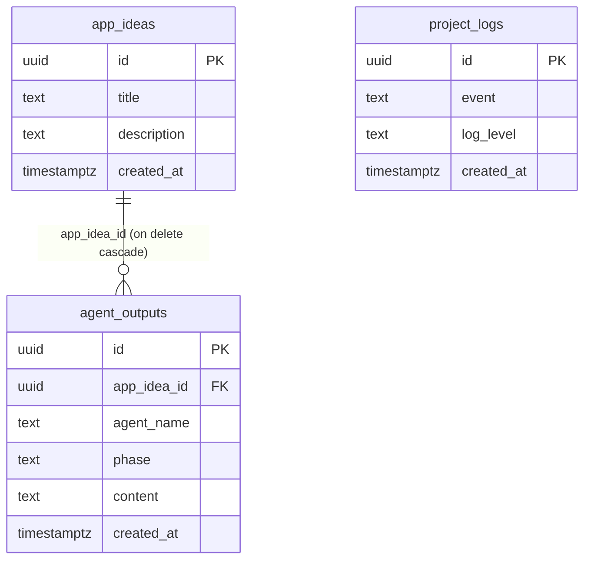

# Data Model — ThinkTank AI

Source of truth: `supabase/migrations/20250614213703-78b5a8c5-1a4b-4f0c-a7fc-160c1ccb6149.sql` (the repository's single migration). Generated TypeScript types for all three tables live in `src/integrations/supabase/types.ts` and type the client in `src/integrations/supabase/client.ts`.

The schema is small and append-only in practice: the app inserts and reads; nothing in the current frontend updates or deletes rows.

---

## Entity overview



`project_logs` is intentionally standalone — an app-wide event feed with no foreign keys.

## Tables

### `public.app_ideas`

One row per idea a user submits in phase 1 of the workflow.

| Column | Type | Constraints / default | Stores |
|---|---|---|---|
| `id` | `uuid` | primary key, default `gen_random_uuid()` | Row identity; captured by the frontend and used to link later phase outputs. |
| `title` | `text` | `not null` | The user's idea text, trimmed (e.g. "Project manager for biologists"). |
| `description` | `text` | nullable | The LLM's phase-1 response — a generated acknowledgement/expansion of the idea. |
| `created_at` | `timestamptz` | `not null`, default `now()` | Insertion time. |

Written by `AgentWorkflow.tsx` when the idea phase completes (`insert({ title, description }).select().maybeSingle()`); the returned `id` is held in component state as `appIdeaId`.

### `public.agent_outputs`

One row per completed pipeline phase after the first — the persistent "memory" of what each agent produced for a given idea.

| Column | Type | Constraints / default | Stores |
|---|---|---|---|
| `id` | `uuid` | primary key, default `gen_random_uuid()` | Row identity. |
| `app_idea_id` | `uuid` | nullable, `references app_ideas(id) on delete cascade` | The idea this output belongs to. Deleting an idea deletes its outputs. |
| `agent_name` | `text` | `not null` | The themed agent for the phase: `Dream Weaver`, `Master Builder`, `Aesthetic Artist`, `Code Sage`, `Quality Guardian`, or `Deployment Master`. |
| `phase` | `text` | `not null` | The phase key: one of `draft`, `plan`, `ui`, `code`, `qa`, `deploy` as written by the current frontend (the `idea` phase is stored in `app_ideas` instead). |
| `content` | `text` | `not null` | The LLM-generated output for that phase, verbatim. |
| `created_at` | `timestamptz` | `not null`, default `now()` | Insertion time. |

Written by `AgentWorkflow.tsx` on each **Approve & Continue** after phase 1 — but only when `appIdeaId` is set (i.e. the phase-1 insert succeeded in the same session). `agent_name` and `phase` are free-text at the database level; the allowed values above are enforced only by the frontend's phase table, not by a constraint or enum.

### `public.project_logs`

A global, append-only event log rendered in the UI ("Recent Project Logs" panel, newest 10 rows).

| Column | Type | Constraints / default | Stores |
|---|---|---|---|
| `id` | `uuid` | primary key, default `gen_random_uuid()` | Row identity. |
| `event` | `text` | `not null` | Human-readable event text. The current app writes two kinds: `Submitted app idea: "<idea>"` and `Phase complete: <phase label>`. |
| `log_level` | `text` | `not null`, default `'info'` | Severity label; the frontend always writes `'info'`. Free text — no enum constraint. |
| `created_at` | `timestamptz` | `not null`, default `now()` | Insertion time, used for `order by created_at desc` in the UI query. |

Not linked to `app_ideas` — log rows survive idea deletion and mix events from all sessions.

## Relationships

- **`app_ideas` 1 → N `agent_outputs`** via `agent_outputs.app_idea_id`, with `on delete cascade`. The FK column is nullable, so orphan-by-construction outputs are representable (the app never writes them, but the schema allows it).
- **`project_logs`** has no relationships — it is a flat event stream.

## Security posture (important)

The migration includes RLS statements **commented out**:

```sql
-- alter table app_ideas enable row level security;
-- alter table agent_outputs enable row level security;
-- alter table project_logs enable row level security;
```

So as migrated, **row level security is not enabled on any table, and no policies exist**. Combined with the anon publishable key shipped in `src/integrations/supabase/client.ts`, anyone with the app's origin can read and write all three tables. There is also no user/ownership column anywhere — the schema predates any auth design. This is acceptable for a private prototype and would be the first thing to fix before real users: add `user_id` columns, enable RLS, and write owner-scoped policies.

## Access patterns in the current app

| Operation | Table | Where in code |
|---|---|---|
| Insert idea + generated description | `app_ideas` | `AgentWorkflow.handleGenerateOutput`, phase index 0 |
| Insert per-phase output | `agent_outputs` | `AgentWorkflow.handleGenerateOutput`, phase index > 0 |
| Insert log events | `project_logs` | `AgentWorkflow.handleGenerateOutput`, both branches |
| Read latest 10 logs | `project_logs` | `AgentWorkflow` effect (on phase change) and after each generation |

No other table access exists in the frontend; nothing reads `app_ideas` or `agent_outputs` back yet (a natural next feature: an idea-history browser powered by the existing FK).

---

*This document is a portfolio sample: professional documentation written for the author's own open prototype project, shown as an example of the codebase-documentation service.*
